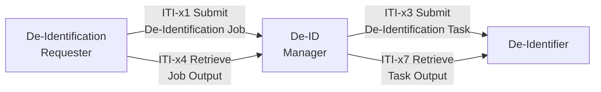
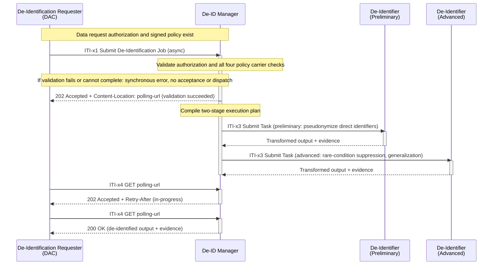
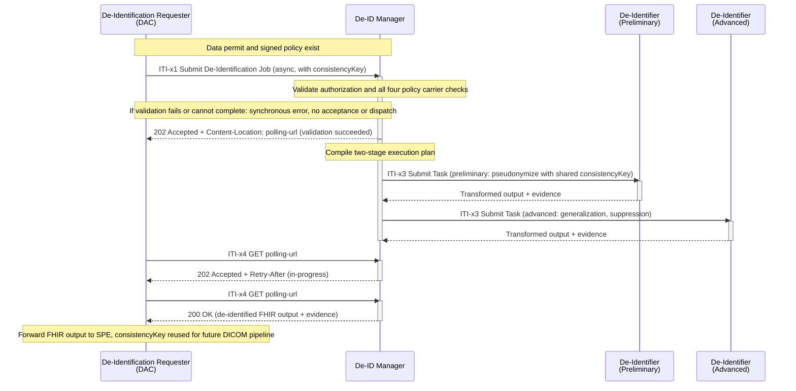
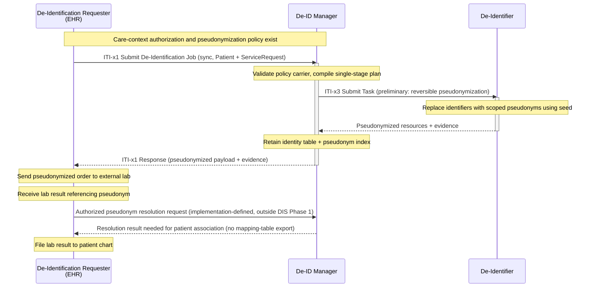
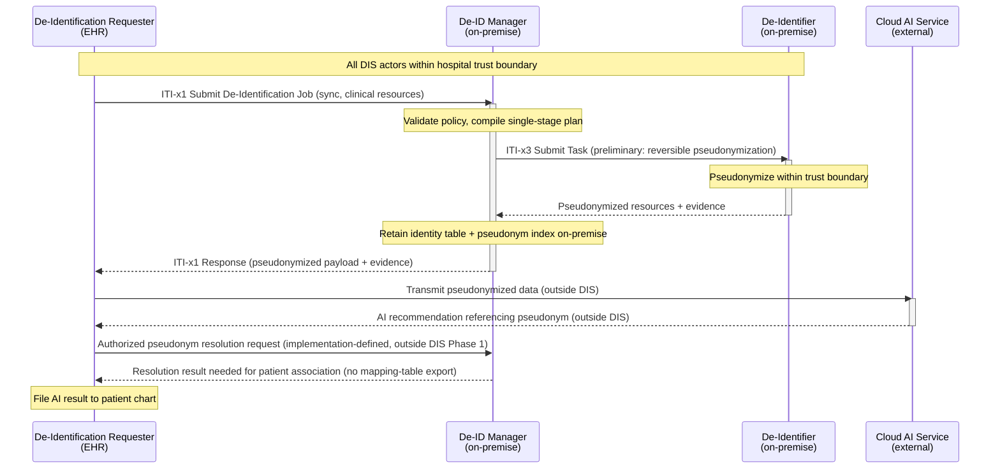
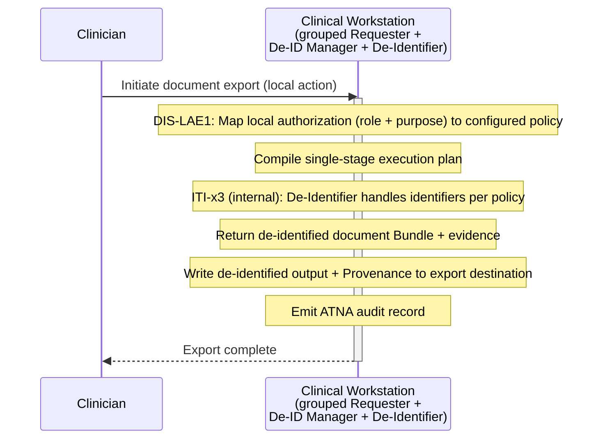

The De-Identification Services (DIS) Profile defines a standardized, policy-governed workflow for de-identification of HL7 FHIR health data. DIS enables authorized requesters to submit de-identification jobs referencing signed policy carriers and data request authorizations, and to receive de-identified output with auditable provenance evidence. The profile supports both synchronous single-patient workflows (such as clinical pseudonymization before external lab ordering or cloud AI invocation) and asynchronous multi-patient cohort workflows (such as cross-border research studies or AI/ML training dataset preparation).

DIS is a **Workflow** profile. It defines three actors, four transactions, a baseline policy execution model, an execution plan format, and a minimum evidence baseline. DIS begins after data request authorization has been established and a de-identification policy has been authorized. It does not standardize how a data permit or data-request approval is requested, approved, issued, discovered, amended, revoked, or retired.

DIS separates core workflow semantics, the FHIR transaction binding, and the version of the processing payload. The initial DIS transaction binding uses FHIR R4 APIs and resources. DIS-FHIR1 supports independently versioned FHIR R4 and R5 processing payloads; support for R5 payloads does not require an R5 binding of the DIS workflow resources. Future transaction bindings may target other FHIR releases while preserving the core workflow semantics.

The processing payload's FHIR version SHALL be explicitly identified. De-Identifiers SHALL declare supported processing payload versions, and the Manager SHALL verify version compatibility before dispatch. Payloads SHALL be validated against their declared version. A payload using a different FHIR version from the transaction binding SHALL be referenced or carried as explicitly identified serialized content using the payload binding's packaging rules; it SHALL NOT be embedded as a native resource of the other version in the transaction envelope. Detailed version identification and packaging rules are to be specified in the DIS-FHIR1 binding.

## 1:52.1 DIS Actors, Transactions, and Content Modules

This section defines the actors and transactions in the DIS Profile.

Figure 1:52.1-1 shows the actors directly involved in the DIS Profile and the relevant transactions between them.

<figure>

<figcaption><strong>Figure 1:52.1-1: DIS Actor Diagram</strong></figcaption>
</figure>
 

<strong>Table 1:52.1-1: DIS Profile - Actors and Transactions</strong>

| Actors | Transactions | Initiator or Responder | Optionality | Reference |
|--------|-------------|------------------------|-------------|-----------|
| De-Identification Requester | ITI-x1 Submit De-Identification Job | Initiator | R | ITI TF-2: 3.x1 |
|  | ITI-x4 Retrieve Job Output | Initiator | O (See Note 1) | ITI TF-2: 3.x4 |
| De-ID Manager | ITI-x1 Submit De-Identification Job | Responder | R | ITI TF-2: 3.x1 |
|  | ITI-x3 Submit De-Identification Task | Initiator | R | ITI TF-2: 3.x3 |
|  | ITI-x4 Retrieve Job Output | Responder | O (See Note 1) | ITI TF-2: 3.x4 |
|  | ITI-x7 Retrieve Task Output | Initiator | O (See Note 2) | ITI TF-2: 3.x7 |
| De-Identifier | ITI-x3 Submit De-Identification Task | Responder | R | ITI TF-2: 3.x3 |
|  | ITI-x7 Retrieve Task Output | Responder | O (See Note 2) | ITI TF-2: 3.x7 |
{: .grid}

Note 1: *ITI-x4 is required when the Asynchronous Job Processing Option is supported.*

Note 2: *ITI-x7 is required when the Deferred Task Output Option is supported.*

### 1:52.1.1 Actors

The actors in this profile are described in more detail in the sections below.

#### 1:52.1.1.1 De-Identification Requester

The De-Identification Requester submits de-identification jobs to the De-ID Manager, presenting a data request authorization and a signed de-identification policy carrier. In the synchronous mode, the Requester receives de-identified output and evidence inline in the ITI-x1 response. In the asynchronous mode, the Requester retrieves output via ITI-x4 polling.

In Phase 1, the De-Identification Requester is grouped with the De-Identified Data Receiver role -- the Requester receives output directly. No separate push-delivery path is standardized.

Phase 1 does not standardize how the Requester obtains a signed de-identification policy carrier. The Requester presents the carrier in ITI-x1; the mechanism by which it was obtained is an implementation-defined concern. Implementers MAY use any mechanism that produces a valid signed policy carrier, including local configuration, administrative provisioning, bilateral agreement, or integration with an external policy management system.

#### 1:52.1.1.2 De-ID Manager

The De-ID Manager receives de-identification jobs via ITI-x1, validates the data request authorization and de-identification policy carrier, compiles the validated policy into an execution plan, dispatches de-identification tasks to De-Identifiers via ITI-x3, and returns de-identified output and provenance evidence to the Requester.

The De-ID Manager is the sole persistent custodian of identity mappings and reversibility records. When reversible pseudonymization is enabled (DIS-RP1), the De-ID Manager retains the identity table (cryptographic seed to patient identity mapping) and builds a pseudonym index from de-identification evidence reported by the De-Identifier at job completion. Together these two tables form the reverse-mapping chain: pseudonym to seed to patient identity. Phase 1 does not standardize re-identification transactions; however, implementations claiming DIS-RP1 SHALL retain reversibility material so that standardized re-identification can be enabled without re-processing previously de-identified data.

The De-ID Manager performs four-point validation on all policy carrier variants:

1. **Signature validity** -- the carrier's digital signature is cryptographically valid and issued by a trusted authority
2. **Schema conformance** -- the policy content conforms to the expected schema
3. **Currency** -- the policy is not expired or revoked
4. **Authorization consistency** -- the policy is consistent with the data request authorization (scope, purpose, and processing target are compatible)

#### 1:52.1.1.3 De-Identifier

The De-Identifier executes assigned de-identification tasks received via ITI-x3. It is stateless with respect to reversibility -- it receives scoped, purpose-specific seeds as required by the assigned rules, produces transformations and evidence, and retains no identity-linking material after task termination. The De-Identifier derives transformation values, such as pseudonyms or date-shift offsets, according to the execution plan and its declared capabilities. It reports pseudonyms needed for reversibility to the Manager but does not retain the seed-to-identity mapping. The Manager supplies policy, scope, and seed material; it is not required to compute pseudonyms or date-shift offsets.

A Phase 1 De-Identifier SHALL declare its capabilities, including supported payload families (at least `fhir` for DIS-FHIR1), supported action families (`core`), and zero or more named standardized policies it natively supports. The declaration SHALL also identify supported transformation parameter inputs and derivation methods. Acceptance of precomputed pseudonyms or date-shift offsets is not mandatory. The De-ID Manager SHALL verify compatibility with the De-Identifier's declared capabilities before dispatching tasks via ITI-x3 and SHALL NOT dispatch an incompatible task.

### 1:52.1.2 Transaction Descriptions

The transactions in this profile are summarized in the sections below.

#### 1:52.1.2.1 Submit De-Identification Job [ITI-x1]

This transaction allows the De-Identification Requester to present a data request authorization and a signed de-identification policy carrier, and to trigger de-identification processing. The De-ID Manager validates the authorization and policy carrier, compiles the policy into an execution plan, orchestrates task execution, and returns de-identified output and evidence. The transaction supports both synchronous (output inline) and asynchronous (job acceptance with polling URL) response modes.

The transaction SHALL reject a job when the data request authorization is missing, untrusted, expired, or inconsistent with the requested processing target. The transaction SHALL also reject a job when the de-identification policy carrier is missing, has an invalid or untrusted signature, is expired, or is inconsistent with the data request authorization. Rejection is always synchronous regardless of the requested response mode.

Before accepting a job or dispatching any task, the De-ID Manager SHALL validate the data request authorization and complete all four policy carrier checks: signature validity, schema conformance, currency, and authorization consistency. If admission validation fails or cannot be completed, the Manager SHALL return a synchronous error response and SHALL NOT accept the job or dispatch tasks. This requirement applies to both synchronous and asynchronous requests.

For an accepted asynchronous job, failures discovered during subsequent processing SHALL be reported through ITI-x4 job status. The Manager SHALL withhold de-identified output from a failed job, including when output validation fails.

For more details see the detailed [transaction description](ITI-x1.html).

#### 1:52.1.2.2 Submit De-Identification Task [ITI-x3]

This transaction allows the De-ID Manager to submit a de-identification task to a De-Identifier. The task carries a reference to a Library resource containing execution rules for the assigned stage, the processing target (or reference to prior stage output), and scoped, purpose-specific seeds when required by the assigned rules and supported parameter inputs. The De-Identifier applies the transformation rules, produces de-identified output and evidence, and returns a completed task with validation status.

When the De-ID Manager compiles multiple stages, ITI-x3 is invoked once per stage in sequence. Each invocation references a Library containing only the rules assigned to that stage -- the De-Identifier SHALL NOT have visibility into stages assigned to other instances.

For more details see the detailed [transaction description](ITI-x3.html).

#### 1:52.1.2.3 Retrieve Job Output [ITI-x4]

This transaction allows the De-Identification Requester to retrieve the status and output of a previously submitted asynchronous job. The De-ID Manager authenticates the Requester, verifies authorization for the specified job, and returns the current job status. When the job is complete, the response includes all output and evidence that would have been returned inline in a synchronous ITI-x1 response.

For more details see the detailed [transaction description](ITI-x4.html).

#### 1:52.1.2.4 Retrieve Task Output [ITI-x7]

This transaction allows the De-ID Manager to retrieve the output of a deferred de-identification task from a De-Identifier. When the De-Identifier uses deferred response mode for ITI-x3, it accepts the task and processes asynchronously; the De-ID Manager retrieves the completed output via ITI-x7.

For more details see the detailed [transaction description](ITI-x7.html).

## 1:52.2 DIS Actor Options

Options that may be selected for each actor in this profile are listed in Table 1:52.2-1 below. Dependencies between options when applicable are specified in notes.

<strong>Table 1:52.2-1: DIS Profile - Actor Options</strong>

| Actor | Option Name | Reference |
|-------|-------------|-----------|
| De-Identification Requester | Asynchronous Job Processing | [1:52.2.1](#15221-asynchronous-job-processing-option) |
| De-ID Manager | Asynchronous Job Processing | [1:52.2.1](#15221-asynchronous-job-processing-option) |
| De-ID Manager | Reversible Pseudonymization | [1:52.2.2](#15222-reversible-pseudonymization-option) |
| De-ID Manager | Local Authorized Export | [1:52.2.4](#15224-local-authorized-export-option) |
| De-Identifier | Reversible Pseudonymization | [1:52.2.2](#15222-reversible-pseudonymization-option) |
| De-Identifier | Deferred Task Output | [1:52.2.5](#15225-deferred-task-output-option) |
{: .grid}

### 1:52.2.1 Asynchronous Job Processing Option

The Asynchronous Job Processing Option (DIS-ASYNC) enables the De-Identification Requester and De-ID Manager to support asynchronous de-identification workflows. When a Requester sends ITI-x1 with `Prefer: respond-async` and admission validation succeeds, the De-ID Manager SHALL return HTTP `202 Accepted` with a `Content-Location` header containing a polling URL. The Requester retrieves de-identified output and evidence via ITI-x4 using the polling URL.

This option is required for multi-patient cohort workflows where processing time exceeds the request timeout. Both the De-Identification Requester and the De-ID Manager SHALL support ITI-x4 when this option is declared.

A De-ID Manager that supports the Asynchronous Job Processing Option SHALL retain the polling endpoint for at least 24 hours after job completion. After successful retrieval, the De-ID Manager MAY return `410 Gone` for subsequent requests per local retention policy.

### 1:52.2.2 Reversible Pseudonymization Option

The Reversible Pseudonymization Option (DIS-RP1) enables the De-ID Manager to retain reversibility material (identity table and pseudonym index) so that future re-identification can be performed without re-processing previously de-identified data. The baseline mode is irreversible de-identification (DIS-RP0).

When this option is supported, the De-ID Manager SHALL:

- Retain the identity table (cryptographic seed to patient identity mapping) created during policy compilation
- Build a pseudonym index from de-identification evidence reported by the De-Identifier at job completion
- Protect identity tables and pseudonym indices within its trust boundary -- these records SHALL NOT be disclosed outside the Manager's trust boundary; seed sharing with authorized De-Identifiers follows §1:52.5.4

A De-Identifier supporting this option SHALL produce pseudonyms that are deterministically derivable from the cryptographic seed, enabling the De-ID Manager to build its reverse-mapping chain from evidence without requiring the De-Identifier to retain any identity-linking material.

UC-3 and UC-4 illustrate authorized, implementation-defined access to the Manager's mapping service for patient association. Such access returns only the resolution result needed by the EHR and does not export the identity table or pseudonym index. Phase 1 does not standardize this interaction or introduce a re-identification transaction.

### 1:52.2.3 Baseline Execution Plan Requirements

Every Phase 1 De-ID Manager and De-Identifier SHALL support DIS-EXE1-Baseline, which supports flat, ordered rule lists. Phase 1 execution plans SHALL NOT require policy composition, condition evaluation, cross-element constraints, conflict resolution strategies, or selector specificity rules. The full Composable Execution Plan Option (DIS-EXE1), including these features, is deferred to a future phase and is not a Phase 1 actor option.

Multi-stage processing remains supported in Phase 1. The De-ID Manager dispatches a separate DIS-EXE1-Baseline plan for each stage through ITI-x3; each plan contains only the ordered rules assigned to that stage.

### 1:52.2.4 Local Authorized Export Option

The Local Authorized Export Option (DIS-LAE1) enables the De-ID Manager to support clinician-initiated local export workflows where authorization derives from the clinician's local role and declared purpose rather than an external data permit. No external policy carrier acquisition is required -- the policy is pre-configured by institutional administration.

When this option is supported, the De-ID Manager SHALL map the local authorization (role and purpose) to a configured de-identification policy using the DIS-LAE1 bridge pattern. The De-ID Manager SHALL validate that the local authorization is consistent with the configured policy before proceeding with task execution.

This option is intended for lightweight clinical workflows such as de-identified document export from a clinical workstation, where heavy external permit infrastructure is not required.

### 1:52.2.5 Deferred Task Output Option

The Deferred Task Output Option (DIS-DEFER) enables the De-Identifier to accept a task via ITI-x3 and process it asynchronously. The De-ID Manager retrieves the completed output via ITI-x7. This option is required for large payloads where task processing time may exceed the ITI-x3 request timeout.

When this option is supported by the De-Identifier, the De-Identifier MAY respond to ITI-x3 with an accepted status and a location for output retrieval. The De-ID Manager SHALL support ITI-x7 when interacting with a De-Identifier that declares this option.

## 1:52.3 DIS Required Actor Groupings

An actor from this profile (Column 1) SHALL implement all of the required transactions and/or content modules in this profile ***in addition to*** ***<u>all</u>*** of the requirements for the grouped actor (Column 2).

<strong>Table 1:52.3-1: DIS Profile - Required Actor Groupings</strong>

| DIS Actor | Actor to be grouped with | Reference | Content Bindings Reference |
|-----------|--------------------------|-----------|---------------------------|
| De-Identification Requester | ATNA / Secure Application | [ITI TF-1: 9](https://profiles.ihe.net/ITI/TF/Volume1/ch-9.html) | -- |
| De-ID Manager | ATNA / Secure Node or Secure Application | [ITI TF-1: 9](https://profiles.ihe.net/ITI/TF/Volume1/ch-9.html) | -- |
| De-ID Manager | IUA / Authorization Client or Resource Server | [ITI TF-1: 34](https://profiles.ihe.net/ITI/TF/Volume1/ch-34.html) | -- |
| De-Identifier | ATNA / Secure Node or Secure Application | [ITI TF-1: 9](https://profiles.ihe.net/ITI/TF/Volume1/ch-9.html) | -- |
{: .grid}

All DIS actors SHALL be grouped with ATNA Secure Node or Secure Application to ensure that all transactions are audit-logged and that communications are secured via TLS.

The De-ID Manager SHALL be grouped with IUA Authorization Client or Resource Server to ensure that system-to-system authorization is enforced for job submission (ITI-x1) and output retrieval (ITI-x4). Implementations SHOULD use SMART Backend Services for automated system-to-system workflows.

## 1:52.4 DIS Overview

This section shows how the transactions of the DIS Profile are combined to address the use cases.

### 1:52.4.1 Concepts

DIS introduces the following key concepts that provide necessary background for understanding the profile.

**Policy-Governed De-Identification.** DIS separates policy definition from policy execution. A signed de-identification policy carrier governs what transformations are applied. The De-ID Manager validates the policy and compiles it into an execution plan; the De-Identifier executes the plan. Trust is anchored in the policy carrier's digital signature, not in the Requester's identity -- the Requester acts as a courier for the signed policy.

**Staged Execution.** DIS supports multi-stage de-identification. A preliminary stage handles direct identifiers (pseudonymization, suppression). An advanced stage handles quasi-identifiers and statistical disclosure control (generalization, rare-condition suppression, noise addition). The De-ID Manager dispatches one ITI-x3 task per stage. Each De-Identifier sees only its assigned stage, enforcing trust isolation between stages.

**Reversibility Custody.** When reversible pseudonymization is enabled, the De-ID Manager retains the identity table and pseudonym index. The De-Identifier is stateless with respect to reversibility. Identity tables and pseudonym indices remain within the Manager's trust boundary. Scoped, purpose-specific seeds may be shared with authorized De-Identifiers in separate trust boundaries under the controls in §1:52.5.4.

**Consistency Keys.** A shared `consistencyKey` ensures that the same patient receives identical pseudonyms across jobs, stages, and (in future phases) across payload standards. This enables longitudinal linkage of de-identified data without exposing patient identity.

**Evidence Baseline.** Every completed de-identification task produces provenance evidence containing at minimum nine elements: evidence identifier, outcome status, workflow reference, target identifier, policy-decision reference, stage category, reversibility state, validation status, and audit correlation identifier.

### 1:52.4.2 Use Cases

#### 1:52.4.2.1 Use Case 1: Cross-Border Epidemiological Study Using IPS+

A research consortium conducts a cross-border epidemiological study combining population-based cancer-registry data with selected clinical information originally collected for healthcare delivery. The study examines incidence, treatment patterns, comorbidities, outcomes, and survival across participating jurisdictions.

##### 1:52.4.2.1.1 Cross-Border Epidemiological Study Use Case Description

Clinical data remain under primary-use governance when recorded or exchanged for care. Their reuse begins only after a secondary-use request has been assessed and an authorization context has been issued. The Data Access Coordinator (DAC) coordinates participating jurisdictions, resolves authorized source-data provision, and -- acting as the De-Identification Requester -- submits a DIS job to produce a pseudonymized, disclosure-controlled dataset suitable for delivery to a Secure Processing Environment (SPE).

The DAC submits an asynchronous ITI-x1 job with a signed policy carrier and FHIR processing targets. The De-ID Manager validates the policy and compiles a two-stage execution plan. The preliminary stage pseudonymizes direct identifiers with reversible, project-scoped pseudonyms using a shared `consistencyKey` to preserve longitudinal linkage. The advanced stage applies rare-condition suppression, small-cell handling, and quasi-identifier generalization. The DAC retrieves the de-identified output and evidence via ITI-x4 polling and forwards it to the SPE.

##### 1:52.4.2.1.2 Cross-Border Epidemiological Study Process Flow

**Figure 1:52.4.2.1.2-1: Use Case 1 - Cross-Border Epidemiological Study Process Flow**

#### 1:52.4.2.2 Use Case 2: Multimodal AI/ML Method Development (FHIR Input-Preparation)

An AI/ML consortium develops or validates cancer models using multimodal data -- structured clinical information, radiology, digital pathology, laboratory data, genomics, annotations, and outcomes. DIS handles the FHIR input-preparation portion of the pipeline.

##### 1:52.4.2.2.1 AI/ML Method Development Use Case Description

The consortium holds a data permit identifying the approved cohort, modalities, linkage requirements, and de-identification stages. The DAC acts as the De-Identification Requester and submits an asynchronous job for the structured clinical data (EHR records, laboratory results, outcome labels, annotations).

The De-ID Manager compiles a two-stage execution plan. The preliminary stage pseudonymizes direct identifiers with reversible, project-scoped pseudonyms using a shared `consistencyKey`. This key is designed to be reused by future DICOM processing so that the same pseudonym links a patient's clinical and imaging data. The advanced stage applies quasi-identifier generalization, rare-condition suppression, and FHIR-specific disclosure control. The DAC retrieves the de-identified FHIR output via ITI-x4 and delivers it to the SPE.

##### 1:52.4.2.2.2 AI/ML Method Development Process Flow

**Figure 1:52.4.2.2.2-1: Use Case 2 - AI/ML Method Development (FHIR Input-Preparation) Process Flow**

#### 1:52.4.2.3 Use Case 3: Clinical Pathology Order (Pseudonymous Care)

A hospital EHR pseudonymizes patient context before sending a laboratory order to an external pathology lab. The lab operates under a pseudonymous-care model and processes orders referencing only the pseudonym.

##### 1:52.4.2.3.1 Clinical Pathology Order Use Case Description

Institutional policy prohibits the external lab from seeing direct patient identifiers. The EHR acts as the De-Identification Requester and submits a synchronous ITI-x1 job with care-context authorization, a pseudonymization policy carrier, and Patient plus ServiceRequest resources.

The De-ID Manager validates the policy and compiles a single-stage execution plan. The De-Identifier replaces patient identifiers with scoped pseudonyms -- the same pseudonym is used for the same patient within the project scope, enabling longitudinal result correlation. The De-ID Manager returns the pseudonymized payload and evidence inline in the ITI-x1 response.

The De-ID Manager retains custody of the identity table and pseudonym index. To associate the returned lab result with the correct patient chart, the EHR uses an authorized, implementation-defined interaction with the Manager's mapping service. The EHR receives only the resolution result needed for this association; the identity table and pseudonym index are not exported. This interaction is outside the transactions standardized by DIS Phase 1.

##### 1:52.4.2.3.2 Clinical Pathology Order Process Flow

**Figure 1:52.4.2.3.2-1: Use Case 3 - Clinical Pathology Order Process Flow**

#### 1:52.4.2.4 Use Case 4: AI-Assisted Clinical Decision Support (Cloud Deployment)

A hospital EHR pseudonymizes patient data before transmitting to a cloud-hosted AI service for clinical decision support. The AI service operates outside the hospital trust boundary and receives only pseudonymized data.

##### 1:52.4.2.4.1 AI-Assisted Clinical Decision Support Use Case Description

A clinician triggers AI decision support for an active patient encounter. The EHR submits the patient's FHIR resources (Observations, Conditions, MedicationStatements, Encounters) to the on-premise De-ID Manager for reversible pseudonymization. The De-ID Manager and De-Identifier operate entirely within the hospital trust boundary -- no identifiable data or protected security material leaves the on-premise environment during the de-identification step.

The De-ID Manager returns the pseudonymized payload synchronously. The EHR transmits pseudonymized data to the cloud AI service and receives recommendations referencing the pseudonym. The EHR uses an authorized, implementation-defined interaction with the Manager's mapping service to associate the AI output with the correct patient chart. The Manager retains custody of the identity table and pseudonym index and returns only the resolution result needed for that association. This interaction is outside the transactions standardized by DIS Phase 1.

Protected security material (identity table, pseudonym index, cryptographic seeds) never leaves the hospital trust boundary.

##### 1:52.4.2.4.2 AI-Assisted Clinical Decision Support Process Flow

**Figure 1:52.4.2.4.2-1: Use Case 4 - AI-Assisted Clinical Decision Support Process Flow**

#### 1:52.4.2.5 Use Case 5: Local Authorized Clinical Document Export

An authorized clinician exports a de-identified FHIR document Bundle from a clinical workstation. Authorization derives from the clinician's local role and declared purpose -- no external data permit is required.

##### 1:52.4.2.5.1 Local Authorized Clinical Document Export Use Case Description

A clinician initiates export of a clinical document (for example, a discharge summary for patient-mediated sharing or a document for external referral). The clinical workstation hosts a grouped De-ID Manager and De-Identifier. The grouped De-ID Manager maps the local authorization to a configured de-identification policy using the DIS-LAE1 bridge pattern. No external policy carrier acquisition is needed -- the policy is pre-configured by institutional administration.

The grouped De-Identifier performs identifier handling per the configured policy and returns the de-identified document Bundle with evidence. The De-ID Manager writes the de-identified output and Provenance evidence to the export destination. An ATNA audit record is emitted recording the policy identifier, stage, outcome, and audit correlation.

This use case demonstrates that DIS supports lightweight local workflows without requiring heavy external permit infrastructure.

##### 1:52.4.2.5.2 Local Authorized Clinical Document Export Process Flow

**Figure 1:52.4.2.5.2-1: Use Case 5 - Local Authorized Clinical Document Export Process Flow**

## 1:52.5 DIS Security Considerations

See ITI TF-2: [Appendix Z.8 "Mobile Security Considerations"](https://profiles.ihe.net/ITI/TF/Volume2/ch-Z.html#z.8-mobile-security-considerations).

DIS processes health data that is identifiable at input and de-identified at output. The security architecture addresses threats arising during the transformation workflow.

### 1:52.5.1 Actor Grouping and Transport Security

All DIS actors SHALL be grouped with ATNA Secure Node or Secure Application ([ITI TF-1: 9](https://profiles.ihe.net/ITI/TF/Volume1/ch-9.html)). This grouping ensures that all DIS transactions are audit-logged and that communications are secured via mutual TLS. Implementations SHALL use TLS 1.2 or later for all DIS transactions.

### 1:52.5.2 Authorization

The De-ID Manager SHALL be grouped with IUA Authorization Client or Resource Server ([ITI TF-1: 34](https://profiles.ihe.net/ITI/TF/Volume1/ch-34.html)). System-to-system authorization for automated workflows SHOULD use SMART Backend Services with OAuth 2.0 client credentials grants. The De-ID Manager SHALL verify that the Requester is authorized under the submitted data request authorization before accepting a job.

### 1:52.5.3 Policy Carrier Integrity

De-identification policy carriers are digitally signed. Trust is anchored in the policy carrier's signature, not in the Requester's identity -- the Requester acts as a courier. The De-ID Manager SHALL verify the signature, schema conformance, currency, and authorization consistency of every policy carrier before job execution. Policy carriers with invalid, expired, or untrusted signatures SHALL be rejected.

### 1:52.5.4 Reversibility Material Custody

The De-ID Manager is the sole persistent custodian of identity mappings and reversibility records (identity table and pseudonym index). These records SHALL NOT be disclosed outside the De-ID Manager's trust boundary.

Seeds SHALL contain no PII and SHALL NOT directly encode patient identity. Seeds remain protected transformation material because possession may enable linkage or reproduction of transformations. The Manager MAY transmit scoped, purpose-specific seeds to an authorized De-Identifier over a protected channel for the assigned task. The Manager and De-Identifier MAY operate in separate trust boundaries; deployment within a shared trust boundary is optional.

The De-Identifier SHALL use received seeds only for the assigned task and SHALL retain them only for task execution, including deferred execution. It SHALL delete them when the task terminates, whether successfully or unsuccessfully, and SHALL retain no identity-linking material after termination. Seeds SHALL NOT be disclosed to data recipients or included in recipient-facing output, evidence, or logs.

Implementations deploying DIS-RP1 (Reversible Pseudonymization) SHALL implement access controls, encryption at rest, and audit logging for all reversibility material. The De-ID Manager SHALL enforce access controls preventing unauthorized access to reversibility material even by other DIS actors.

### 1:52.5.5 Trust Isolation Between Stages

When the De-ID Manager compiles a multi-stage execution plan, each De-Identifier receives only the execution rules for its assigned stage. A De-Identifier performing the advanced stage (quasi-identifier generalization, suppression) does not have access to the preliminary stage's pseudonym-to-identity mappings. This stage-scoped dispatch provides defense-in-depth: compromise of a single De-Identifier does not expose the complete identity-to-pseudonym chain.

### 1:52.5.6 Audit Logging

All DIS transactions SHALL generate ATNA audit events. Every completed de-identification task produces evidence containing an audit correlation identifier linking the de-identification event to the ATNA audit trail. Implementations SHOULD use IHE Basic Audit Log Patterns (BALP) for structured audit events.

## 1:52.6 DIS Cross-Profile Considerations

### IHE IUA - Internet User Authorization

The De-ID Manager groups with IUA for system-to-system authorization. IUA Authorization Client is used when the De-ID Manager needs to obtain tokens; IUA Resource Server is used when the De-ID Manager validates tokens presented by the De-Identification Requester. Implementations using SMART Backend Services for automated workflows operate through the IUA framework.

### IHE ATNA / BALP - Audit Trail and Node Authentication / Basic Audit Log Patterns

All DIS actors group with ATNA for transport security and audit logging. Implementations SHOULD use BALP for structured, FHIR-based audit event representation. The audit correlation identifier in DIS de-identification evidence links de-identification events to the broader ATNA audit trail, enabling end-to-end traceability from authorization through de-identification to output delivery.

### IHE MHD - Mobile Access to Health Documents

When de-identified output is delivered to a document sharing infrastructure, the De-Identification Requester (or a downstream consumer) MAY group with MHD Document Source to publish de-identified documents. MHD provides a FHIR-native document sharing transport that complements the DIS de-identification workflow.

### SMART on FHIR Backend Services

SMART Backend Services provides the OAuth 2.0 client credentials flow used for system-to-system authorization in automated DIS workflows. This is the recommended authorization pattern for server-to-server interactions where no end-user is present (for example, asynchronous cohort de-identification jobs submitted by a Data Access Coordinator).

### External Data Permit and Data Request Profiles

DIS consumes data request authorizations but does not produce them. The data request authorization presented in ITI-x1 is obtained through mechanisms outside DIS -- including national EHDS infrastructure, institutional governance workflows, bilateral agreements, or integration with external data permit services. DIS validates the authorization but is agnostic to its origin.
